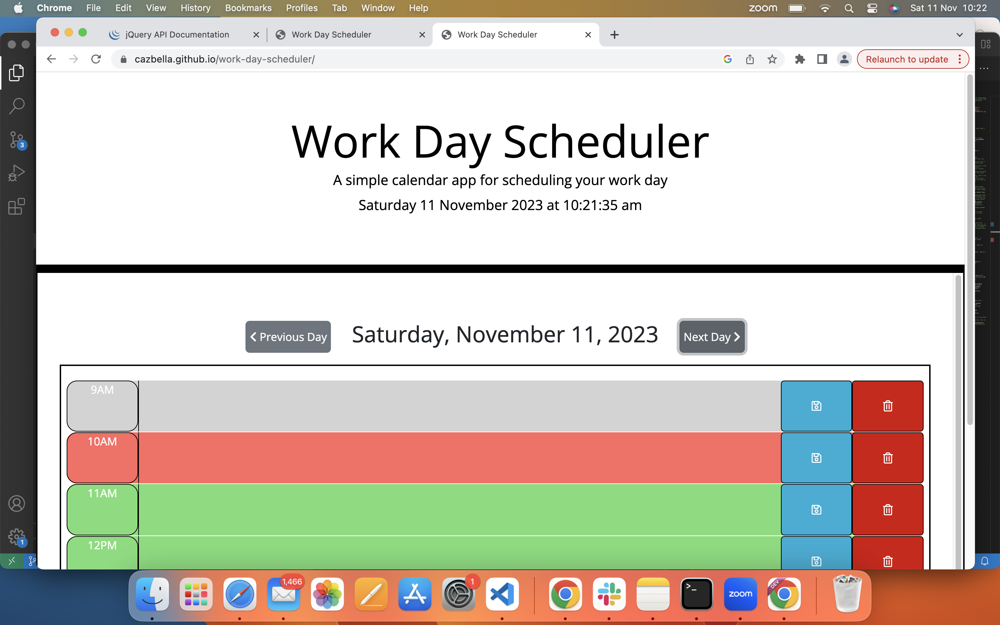
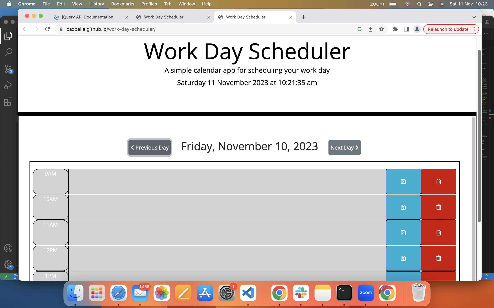
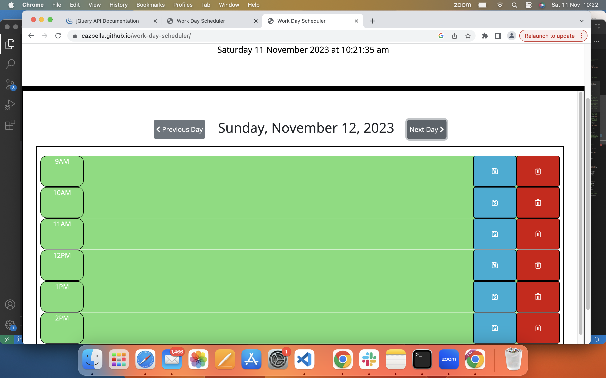

# work-day-scheduler
A daily calendar application that allows a user to save events for each hour of the day. The calendar also provides functionality to delete events and to navigate to other days and save events in them. 

https://cazbella.github.io/work-day-scheduler/

This project is designed to solve the challenges set out in the requirements of the Module 07 Challenge in the EdX Frontend Web Development Bootcamp. It primarily uses JavaScript with JQuery. It also utilises some bootstrap and begins to use third party APIs.  

## Description

This project is an application that presents the user with a 'Work Day Scheduler

Please find a screenshot below of the landing area with the console;

One of the hardest things on this project was understanding the logic behind 'setItem' and 'getItem', and how the web browser works. I also had to look up a lot of syntax and stil have a lot to try to remember here! I also screen recorded a video but 

I have completed a JavaScript course previously, but I had not encountered some of the syntax required. I have used a lot of the logic that we talked about in class this week. 

## Usage

Please find a link to the live application here; 

https://cazbella.github.io/

The video below shows how the application works. 

1. Please click the area inside the hour required in order to input text. Type an event into a time block. Then click the save button to save the event. 

2. If the user navigates to a past or future day, or refreshes the page, the events persist on the page as they are saved to local storage in the browser. 

3. The time blocks are colour coded. As shown on the landing page, current hour is red, past hours are grey and future hours are green. If the user navigates to a different day in the past, all blocks are grey. If the user navigates to a different day in the future, all blocks are green.

This image shows the past; 

This image shows the future

4. I also added a delete button so the user can delete events as necessary. 

__The Console__
_______________
It is a requirement that there are no errors in the console.

Please open the HTML file in the browser and inspect the page. Then please view the console. You should see that there are no errors. The video should also show this. 

__A Note about Pseudocode__
_____________________________

The JavaScript files that contain this code contains lots of comments. The tutor was asked if this was good practice and the advice given was that as I am new to web development, there should be lots of comments at this stage. Hopefully the comments and the commits explain the process I followed to complete the assignment. I have also made notes here to help me remember the process and what the syntax means. 

__A Note about Function__
_________________________

I have tried several things to try and improve responsiveness for a mobile screen. I will keep trying!

## References

I completed the Northcoders pre-work JavaScript module, so I had a foundation knowledge of some of the concepts covered. I have used google a lot this week, including Stack Overflow, W3 schools and MDN web docs. I have used ask the tutor this week for help coding some of my functions. Pages in particular that I have used to complete this task were;
https://www.w3schools.com/jquery/html_removeclass.asp
https://codepen.io/travishorn/pen/oLgyPO
https://day.js.org/docs/en/get-set/get
https://api.jquery.com/text/#text

## Contributing

I would very much appreciate some feedback on the methods I have used to achieve the task. Is this the most concise code I could have used? I would also like to know if the readme layout and content was appropriate for the task if possible please. 

## License

[MIT](https://choosealicense.com/licenses/mit/)
